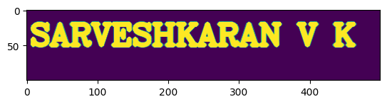
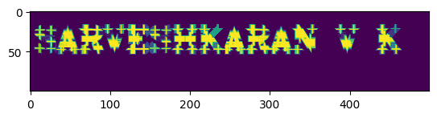
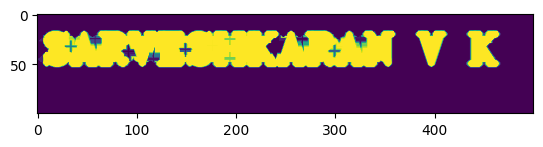

# Opening-and-Closing

## Aim
To implement Opening and Closing using Python and OpenCV.

## Software Required
1. Anaconda - Python 3.7
2. OpenCV
## Algorithm:
### Step1:
<br>Import the necessary packages.


### Step2:
<br>Create the Text using cv2.putText.

### Step3:
<br>Create the structuring element.

### Step4:
<br>Use Opening operation.

### Step5:
<br>Use Closing Operation.
Step 6:
<br>Print the output and end the program.
 
## Program:

``` Python
# Import the necessary packages

Developed by: SARVESHKARAN V K
Reg no : 212221230089

import numpy as np
import matplotlib.pyplot as plt
import cv2


# Create the Text using cv2.putText
img=np.zeros((100,500),dtype='uint8')
font=cv2.FONT_HERSHEY_COMPLEX
img1=cv2.putText(img,'SARVESHKARAN V K',(5,50),font,1.4,(255),5,cv2.LINE_AA)
plt.imshow(img1)


# Create the structuring element
Kernel=cv2.getStructuringElement(cv2.MORPH_CROSS,(11,11))


# Use Opening operation

image1=cv2.morphologyEx(img,cv2.MORPH_OPEN,Kernel)
plt.imshow(image1)


# Use Closing Operation

image1=cv2.morphologyEx(img,cv2.MORPH_CLOSE,Kernel)
plt.imshow(image1) 


```
## Output:

### Display the input Image


### Display the result of Opening


### Display the result of Closing


## Result
Thus the Opening and Closing operation is used in the image using python and OpenCV.
